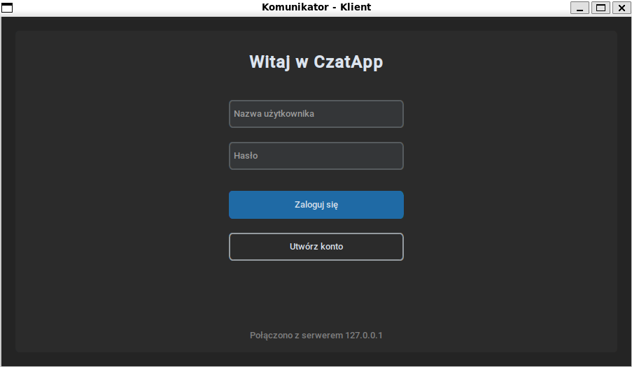
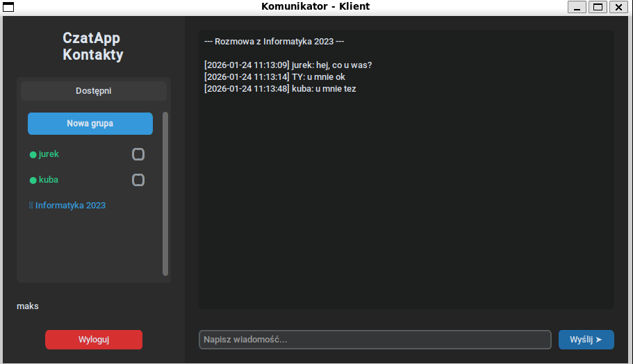
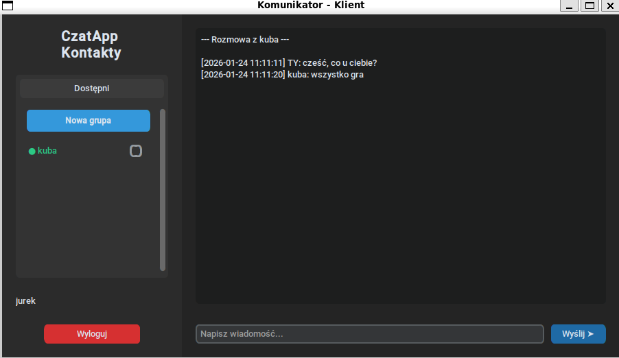

# 💬 Czat TCP – Klient / Serwer

Prosta aplikacja czatu typu **klient–serwer**, napisana w **C++ (serwer)** oraz **Python (klient)**.  
Projekt umożliwia komunikację prywatną oraz grupową z wykorzystaniem protokołu TCP i bazy danych SQLite.

---

## 📸 Zrzuty ekranu

### 🔐 Ekran logowania


### 👥 Czat grupowy


### 💬 Czat prywatny


---

## 🧠 Opis projektu

Aplikacja składa się z:
- **Serwera TCP** (C++), obsługującego wielu klientów jednocześnie (wielowątkowość).
- **Klienta GUI** (Python + `customtkinter`) z nowoczesnym, ciemnym interfejsem.

Serwer odpowiada za:
- autoryzację użytkowników,
- obsługę połączeń,
- zapisywanie i odczyt wiadomości z bazy danych,
- zarządzanie grupami.

Klient umożliwia wygodną komunikację w czasie rzeczywistym.

---

## ⚙️ Wymagania

### 🖥️ Serwer (Linux / Unix)
- GCC z obsługą **C++17**
- `libsqlite3-dev`
- `pthread`
- `make`

### 🧑‍💻 Klient
- **Python 3.x**
- biblioteka `customtkinter`

---

## 🚀 Instalacja i uruchomienie

### 1️⃣ Serwer

Przejdź do katalogu z kodem serwera i skompiluj projekt:

```bash
cd src
make
